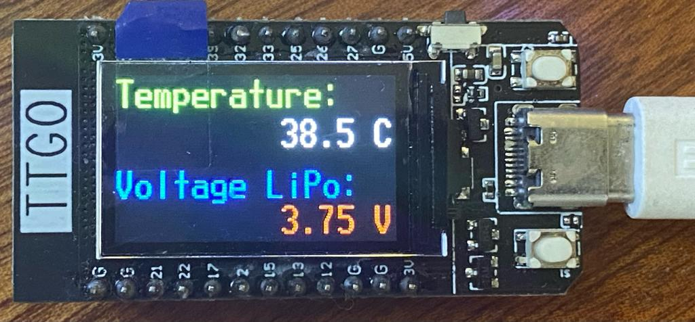

# Documentation of the 'Temp' Project
[](https://GitHub.com/kreier/temp/releases/)
[](https://kreier.mit-license.org/)

We want to measure a temperature at a station, transmit the value to the database via the internet, and be able to read measurements on a webpage.

## 1. Data collection

A TTGO T-Display has a LM35 analog temperature sensor connected to pin 12. With 10 mV/degree Celsius this results in 300 mV on the output pin for 30 Degrees measurement. The hardware setup looks like this:



The analog input pin is ADC15 and has a significant non-linearity. The offset function is `v = 0.826x + 150 ` to convert the raw mV measurement x into a temperature.

This Temperature is displayed on the little display, the code is:

``` py
from machine import Pin, SPI
import st7789

import vga1_16x32 as font

white = st7789.color565(255,255,255)
blue  = st7789.color565(0,0,255)
green = st7789.color565(0,255,0)
red   = st7789.color565(255,0,0)
black = st7789.color565(0,0,0)

def main():
    tft = st7789.ST7789(
        SPI(2, baudrate=30000000, polarity=1, phase=1, sck=Pin(18), mosi=Pin(19)), miso=Pin(14),
        135, 240,
        reset = Pin(23, Pin.OUT),
        cs    = Pin(5,  Pin.OUT),
        dc    = Pin(16, Pin.OUT),
        backlight = Pin(4, Pin.OUT),
        rotation=1)

    tft.init()
    tft.fill(0)
    tft.text(font, "Temperature:",  0,   0, green, black)
    tft.text(font, "38.5 C",      140,  32, white, black)
    tft.text(font, "Voltage LiPo:", 0,  74, blue,  black)
    tft.text(font, "3.75 V",      140, 102, red,   black)

main()
```

Inspiration from [https://randomnerdtutorials.com/esp32-esp8266-mysql-database-php/](https://randomnerdtutorials.com/esp32-esp8266-mysql-database-php/).

## 2. Data submission

We are using WiFi and http to submit our data to a webpage https://kreier.org/temp/post-temperature.php in the JSON format. 

### 2.1 Submit the data

The POST command is the following:

``` c
HTTPClient http;
http.begin(client, serverName);
http.addHeader("Content-Type", "application/x-www-form-urlencoded");
// Prepare your HTTP POST request data
String httpRequestData = "api_key=" + apiKeyValue + "&sensor=" + sensorName
                      + "&location=" + sensorLocation + "&value1=" + String(bme.readTemperature())
                      + "&value2=" + String(bme.readHumidity()) + "&value3=" + String(bme.readPressure()/100.0F) + "";
// Send HTTP POST request
int httpResponseCode = http.POST(httpRequestData);

```
every httpResponseCode > 0 is good! Errorcode is <0.

#### POST text or json

``` c
// If you need an HTTP request with a content type: text/plain
//http.addHeader("Content-Type", "text/plain");
//int httpResponseCode = http.POST("Hello, World!");
    
// If you need an HTTP request with a content type: application/json, use the following:
//http.addHeader("Content-Type", "application/json");
//int httpResponseCode = http.POST("{\"value1\":\"19\",\"value2\":\"67\",\"value3\":\"78\"}");
// the created JSON string is {"value1":"19","value2":"67","value3":78"}
```

### 2.2 Analyze the response

It would be helpful to see if the submitted data was posted into the database. Let's go 2 way here:
- Analyse the returned code
- Check content in the database before deleting local data

This leads to

- Data collection unit ESP32, connected to the internet
  - Solar powered
  - Remote software update possible
- Website [kreier.org/temp/](https://kreier.org/temp/) to display the measurements
  - The most recent data is available
  - Some graphical visualization represent last day, week, month, year
  - Data read from a database MySQL via PHP on the website
- Backend of website
  - Data can be submitted via json
  - Data files are created into the [/data](https://kreier.org/temp/data/) subfolder

## History

### 2021/12/01 Start physical site

Some scaffold data was uploaded to [kreier.org/temp/](https://kreier.org/temp/). Now you get a http response.

Further inspiration is taken from Rui Santos and an example from Germany:
- [https://randomnerdtutorials.com/esp32-esp8266-mysql-database-php/](https://randomnerdtutorials.com/esp32-esp8266-mysql-database-php/)
- [http://wetter.cuprum.de/](http://wetter.cuprum.de/)

### 2021/11/19 New start with ESP32

The project was sticking in my head for some time. I would need this framework as foundation for larger data collection projects like solar- and wind data. The new project [github.com/kreier/temp](https://github.com/kreier/temp/) was born.

### 2020/12/16 New hardware with ESP8266 and LM35

A less expensive approach was started in December 2020. The hardware was succesfully build, but the database was never implemented.


### 2013/11/23 Start of temp.hofkoh.de

A similar project was started in November 2013. It submitted data until summer 2016. A documentation of the code and data can be found here on Github under [github.com/kreier/temp.hofkoh.de](https://github.com/kreier/temp.hofkoh.de)
