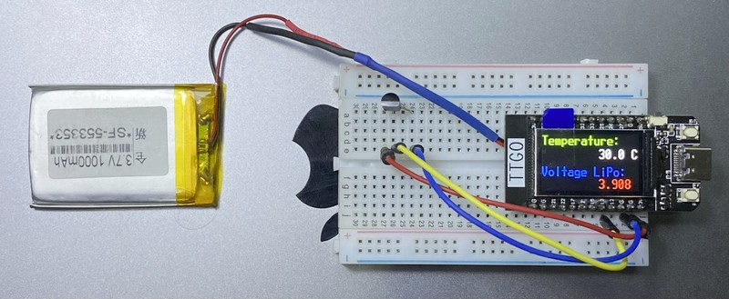
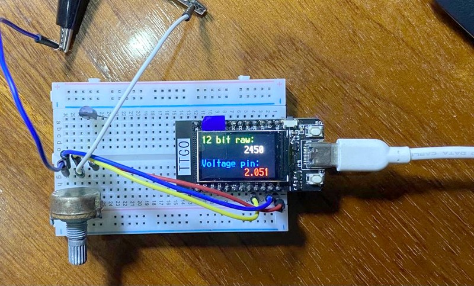
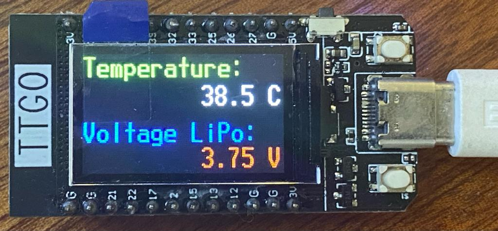

# Temp project - measurement station


## Actual measurement of the Temperature and LiPo Voltage - April 1st, 2022

The LM35 is powered by 3.3 Volt and the output voltage (v/10) gives the temperature, since 10 mV per degree Celsius are created.


## Third setup - with a TTGO T-Display

This setup allows for easier debugging, direct response in REPL and on the display.

### April 11th, 2022 - publish temperature and voltage to Adafruit IO via MQTT and display on the TFT

It takes a few test cycles to get the MQTT station talk to the broker at Adafruit (`unique_id` and `user` and `password` as well as `is_connected` challenges) with Micropython instead of Circuitpython and the provided libraries. But eventually the data is submitted every 60 seconds. In parallel the TFT shows which steps are currently done, before reducing the current consumption from 69mA to 9mA when going to `machine.lightsleep(60000)`.

https://user-images.githubusercontent.com/43933271/162670978-924e22cc-f871-41c0-9fe6-df1d4c08fd56.mov

A few other details could be noticed. The voltage pin for measuring the temperature is moved from pin 12 to pin 36 and therefore from ADC2 to ADC1. It is one of the limitations of the ESP32 that the second ADC can't be used when WiFi is used. There are some workarounds and hacks with register entries, but the current solution provides for 7 usable analog inputs. And their limitation is a minimum voltage of 110 - 150 mV until they produce a reading. 

The obvious choice is to move to the T-Display with the ESP32-S2. No ADC limitations for voltage or pins, support for Circuitpython and SD-Card reader. Though the LiPo battery pin is not connected to the voltage divider input pin, but that is easier to solve.

### April 4th, 2022 - measuring temperature and LiPo voltage

With the calibration it is easy to measure the LiPo-battery voltage and the temperature measured by the LM35:



``` py
# /micropython/apps/temperature_tft.py

from machine import Pin, SPI, ADC
import st7789, time

import vga1_16x32 as font

pin_temp = ADC(Pin(12))
pin_temp.atten(ADC.ATTN_11DB)  # full range: 3.3V
pin_lipo = ADC(Pin(34))
pin_lipo.atten(ADC.ATTN_11DB)

white = st7789.color565(255,255,255)
blue  = st7789.color565(0,0,255)
green = st7789.color565(0,255,0)
red   = st7789.color565(255,0,0)
black = st7789.color565(0,0,0)

tft = st7789.ST7789(
    SPI(2, baudrate=30000000, polarity=1, phase=1, sck=Pin(18), mosi=Pin(19), miso=Pin(14)),
    135, 240,
    reset = Pin(23, Pin.OUT),
    cs    = Pin(5,  Pin.OUT),
    dc    = Pin(16, Pin.OUT),
    backlight = Pin(4, Pin.OUT),
    rotation=1)
tft.init()
tft.fill(0)

def main():
    temp_raw = supersample(pin_temp, 100)
    lipo_raw = supersample(pin_lipo, 100)
    text1   = "{:.1f} C   ".format(temp_raw * 0.0793 + 10.8)
#    text2   = "{:.} ".format(lipo_raw)
    text2   = "{:.3f} V   ".format((lipo_raw * 0.000793 + 0.108) * 2)
    tft.text(font, "Temperature:",    0,   0, green, black)
    tft.text(font, text1,           140,  32, white, black)
    tft.text(font, "Voltage LiPo:",   0,  74, blue,  black)
    tft.text(font, text2,           140, 102, red,   black)

def supersample(pin, iterations):
    raw = 0
    for k in range(iterations):
        raw += pin.read()
    raw = raw / iterations
    return raw

while True:
    main()
    time.sleep(0.5)
    
print("Done.")

```

### April 3rd, 2022 - measuring a voltage, calibrating

With a multimeter and data recording on the tft the ADC was calibrated to __voltage = 0.793x + 108__ in millivolt with x as the 12bit digital output of the ADC:



``` py
# /micropython/apps/calibrate_adc.py

from machine import Pin, SPI, ADC
import st7789, time

import vga1_16x32 as font

pin_adc = ADC(Pin(12))
pin_adc.atten(ADC.ATTN_11DB)  # full range: 3.3V

white = st7789.color565(255,255,255)
blue  = st7789.color565(0,0,255)
green = st7789.color565(0,255,0)
red   = st7789.color565(255,0,0)
black = st7789.color565(0,0,0)

tft = st7789.ST7789(
    SPI(2, baudrate=30000000, polarity=1, phase=1, sck=Pin(18), mosi=Pin(19), miso=Pin(14)),
    135, 240,
    reset = Pin(23, Pin.OUT),
    cs    = Pin(5,  Pin.OUT),
    dc    = Pin(16, Pin.OUT),
    backlight = Pin(4, Pin.OUT),
    rotation=1)
tft.init()
tft.fill(0)

def main():
    pin_raw = supersample(100)
    text1   = "{:}   ".format(int(pin_raw))
    text2   = "{:.3f} V   ".format(pin_raw * 0.000793 + 0.108)
    tft.text(font, "12 bit raw:",    0,   0, green, black)
    tft.text(font, text1,          140,  32, white, black)
    tft.text(font, "Voltage pin:",   0,  74, blue,  black)
    tft.text(font, text2,          140, 102, red,   black)

def supersample(iterations):
    raw = 0
    for k in range(iterations):
        raw += pin_adc.read()
    raw = raw / iterations
    return raw

while True:
    main()
    time.sleep(0.5)
```


### March 26, 2022 - getting started

The firmware was taken from Russ Hughes [st7789 Micropython](https://github.com/russhughes/st7789_mpy/) project. Latest here: 1.18. Flashing with
``` sh
esptool.exe flash_id
esptool.exe read_mac

esptool.exe --port COM23 erase_flash
esptool.exe --port COM23 write_flash -z 0x1000 firmware.bin
```

Programming was done with Thonny. Since MicroPython v1.14 you have to explicit declare the MISO pin, even though it is not used.



``` py
# /micropython/apps/temperature_sketch.py

from machine import Pin, SPI
import st7789

import vga1_16x32 as font

white = st7789.color565(255,255,255)
blue  = st7789.color565(0,0,255)
green = st7789.color565(0,255,0)
red   = st7789.color565(255,0,0)
black = st7789.color565(0,0,0)

def main():
    tft = st7789.ST7789(
        SPI(2, baudrate=30000000, polarity=1, phase=1, sck=Pin(18), mosi=Pin(19)), miso=Pin(14),
        135, 240,
        reset = Pin(23, Pin.OUT),
        cs    = Pin(5,  Pin.OUT),
        dc    = Pin(16, Pin.OUT),
        backlight = Pin(4, Pin.OUT),
        rotation=1)

    tft.init()
    tft.fill(0)
    tft.text(font, "Temperature:",  0,   0, green, black)
    tft.text(font, "38.5 C",      140,  32, white, black)
    tft.text(font, "Voltage LiPo:", 0,  74, blue,  black)
    tft.text(font, "3.75 V",      140, 102, red,   black)

main()
```

## Second setup from December 1, 2021

This is the new breadboard setup with ESP32 in December 2021:


The code it is running is
``` c
// Original sniplet v0.1 from 2020/10/26 - uploaded again more than a year later
// https://github.com/kreier/ESP32/blob/master/sniplets/temp_LM35/temp_LM35.ino
//
// temperature measurement with LM35 v0.2 2021/12/01
//                                   v0.1 2020/10/26
//                                 ____
// pins on LM 35    1 -- 4-20V --- |   \
//                  2 -- OUT ----- |    |
//                  3 -- GND ----- |___/
//
// conversion digital value -> voltage: v = 0.826x + 150     in millivolt
// conversion voltage -> temperature:   T = v / 10           since 10 mV per degree Celcius


const int ledPin = 2;
const bool light = HIGH;
const bool dark  = !light;
const int tempPin = 4;

int count = 0; 
int tempValue = 0;
float temperature = 0;

void setup() {
  pinMode(ledPin, OUTPUT);
  Serial.begin(115200);
  Serial.println("Let's start!");
}  

void loop() {
  digitalWrite(ledPin, light);
  tempValue = 0;
  // measure 100x
  for(int i = 0; i < 100; i++) {
    tempValue += analogRead(tempPin);
  }
  temperature = tempValue / 100;  // from multisampling
  temperature = 0.826 * temperature + 150;
  temperature = temperature / 10; 
  //Serial.print("Temperature right now: ");
  Serial.println(temperature);
  delay(10);
  digitalWrite(ledPin, dark);
  delay(1000);
}
```

## Outline from November 24, 2021

For simplicity we program the measurement station in Arduino C.  The software has main 3 tasks to perform

- Measure the temperature
- Connect to the WiFi
- Connect to the server/API and submit the data

Further extensions can include

- Analyse the response from the server for successful submission
- Have the station powered by a LiIon backup battery
- Check battery voltage and adjust power consumption (deep_sleep) accordingly
- Store measurements locally if submission to the database is not possible

## Setup from December 16, 2020

As a proof of concept setup I used a cheap ESP8266 board and a LM35 temperature sensor to replicate my setup from 2013.


## Project start 2013 - documentation on github

The initial setup needed a small linux system on a TP-Link router (OpenWRT) and a 1wire sensor for the temperature with a USB interface. But it worked for some years!

[https://github.com/kreier/temp.hofkoh.de](https://github.com/kreier/temp.hofkoh.de)

