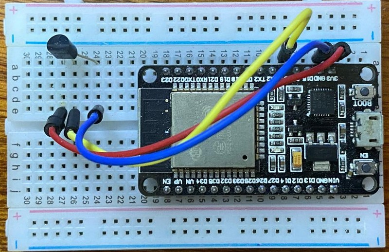

# Temp project - measurement station

## Code in MicroPython with a T-Display

This setup allows for easier debugging, direct response in REPL and on the display.

The firmware was taken from Russ Hughes [st7789 Micropython](https://github.com/russhughes/st7789_mpy/) project. Latest here: 1.18. Flashing with
``` sh
esptool.exe flash_id
esptool.exe read_mac

esptool.exe --port COM23 erase_flash
esptool.exe --port COM23 write_flash -z 0x1000 firmware.bin
```

Programming was done with Thonny. It only works with MicroPython v1.12 and v1.17.

``` py
from machine import Pin, SPI
import st7789

import vga1_16x32 as font

white = st7789.color565(255,255,255)
blue  = st7789.color565(0,0,255)
green = st7789.color565(0,255,0)
red   = st7789.color565(255,0,0)
black = st7789.color565(0,0,0)

def main():
    tft = st7789.ST7789(
        SPI(2, baudrate=30000000, polarity=1, phase=1, sck=Pin(18), mosi=Pin(19)),
        135, 240,
        reset = Pin(23, Pin.OUT),
        cs    = Pin(5,  Pin.OUT),
        dc    = Pin(16, Pin.OUT),
        backlight = Pin(4, Pin.OUT),
        rotation=1)

    tft.init()
    tft.fill(0)
    tft.text(font, "Temperature:",  0,   0, green, black)
    tft.text(font, "38.5 C",      140,  32, white, black)
    tft.text(font, "Voltage LiPo:", 0,  74, blue,  black)
    tft.text(font, "3.75 V",      140, 102, red,   black)

main()
```

## Second setup from December 1, 2021

This is the new breadboard setup with ESP32 in December 2021:



The code it is running is
``` c
// Original sniplet v0.1 from 2020/10/26 - uploaded again more than a year later
// https://github.com/kreier/ESP32/blob/master/sniplets/temp_LM35/temp_LM35.ino
//
// temperature measurement with LM35 v0.2 2021/12/01
//                                   v0.1 2020/10/26
//                                 ____
// pins on LM 35    1 -- 4-20V --- |   \
//                  2 -- OUT ----- |    |
//                  3 -- GND ----- |___/
//
// conversion digital value -> voltage: v = 0.826x + 150     in millivolt
// conversion voltage -> temperature:   T = v / 10           since 10 mV per degree Celcius


const int ledPin = 2;
const bool light = HIGH;
const bool dark  = !light;
const int tempPin = 4;

int count = 0; 
int tempValue = 0;
float temperature = 0;

void setup() {
  pinMode(ledPin, OUTPUT);
  Serial.begin(115200);
  Serial.println("Let's start!");
}  

void loop() {
  digitalWrite(ledPin, light);
  tempValue = 0;
  // measure 100x
  for(int i = 0; i < 100; i++) {
    tempValue += analogRead(tempPin);
  }
  temperature = tempValue / 100;  // from multisampling
  temperature = 0.826 * temperature + 150;
  temperature = temperature / 10; 
  //Serial.print("Temperature right now: ");
  Serial.println(temperature);
  delay(10);
  digitalWrite(ledPin, dark);
  delay(1000);
}
```

## Outline from November 24, 2021

For simplicity we program the measurement station in Arduino C.  The software has main 3 tasks to perform

- Measure the temperature
- Connect to the WiFi
- Connect to the server/API and submit the data

Further extensions can include

- Analyse the response from the server for successful submission
- Have the station powered by a LiIon backup battery
- Check battery voltage and adjust power consumption (deep_sleep) accordingly
- Store measurements locally if submission to the database is not possible
